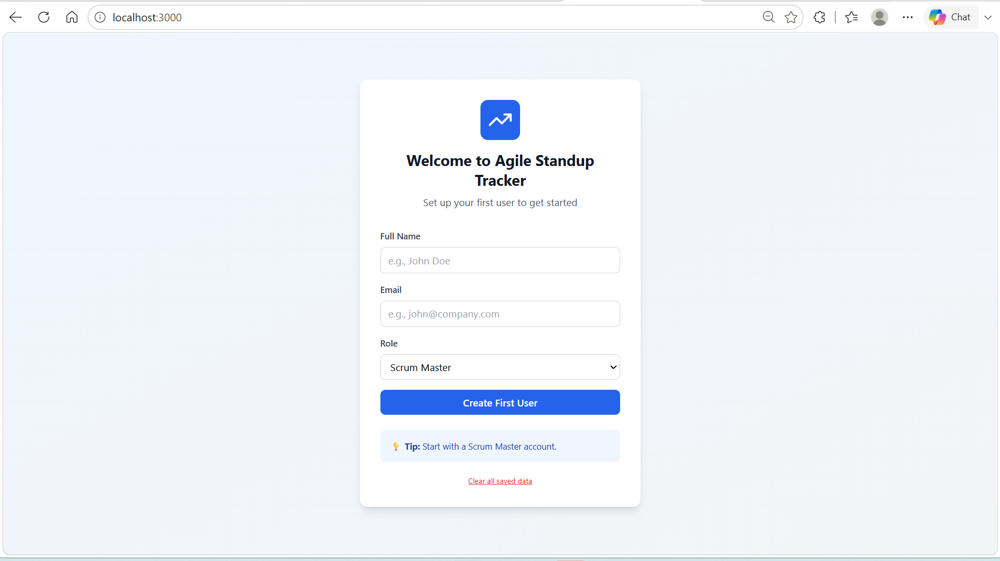
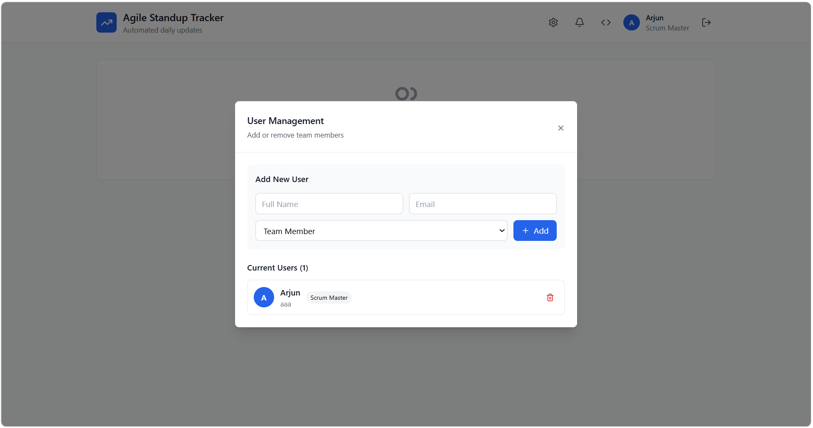
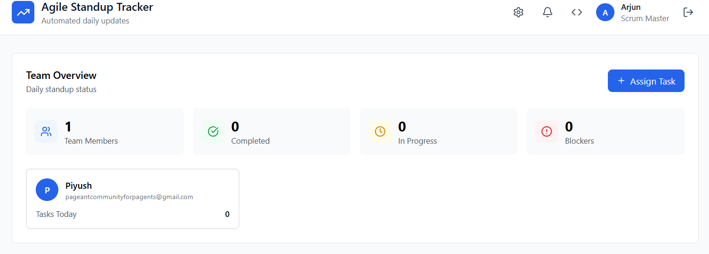
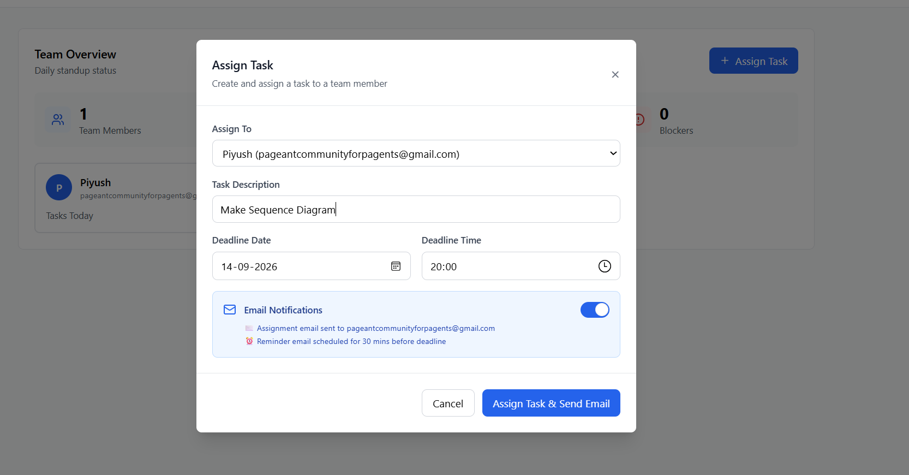
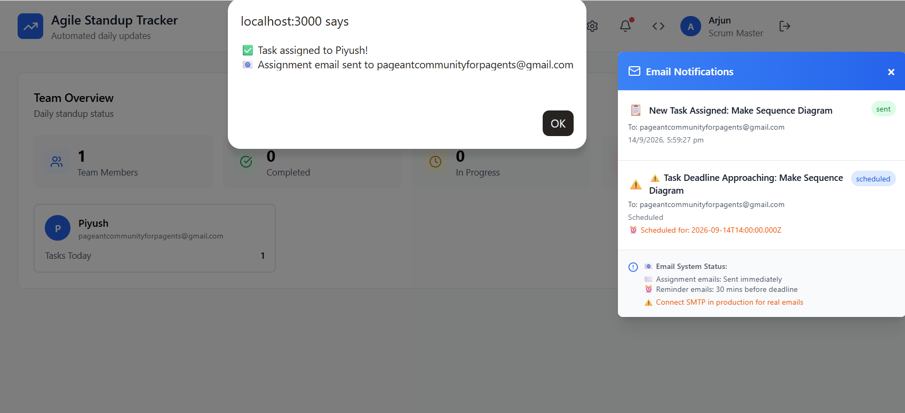
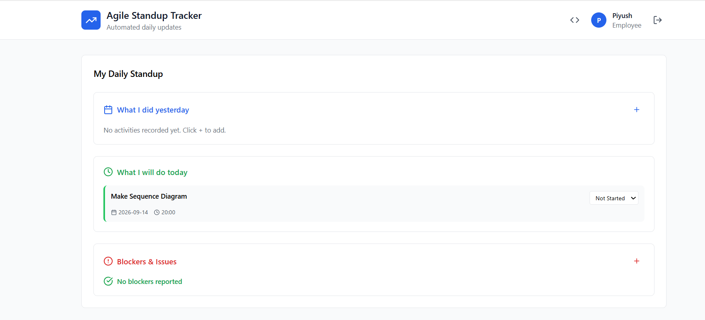
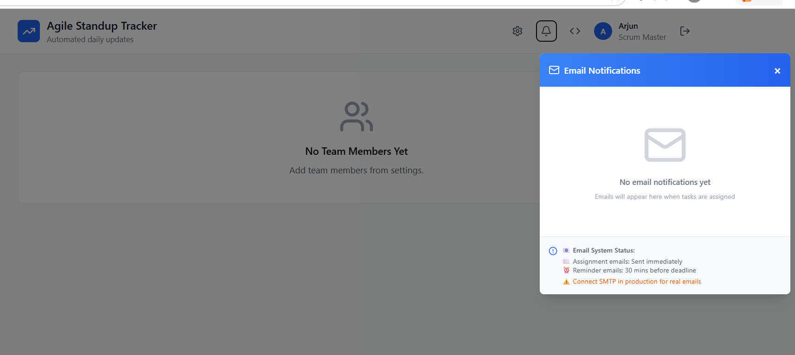
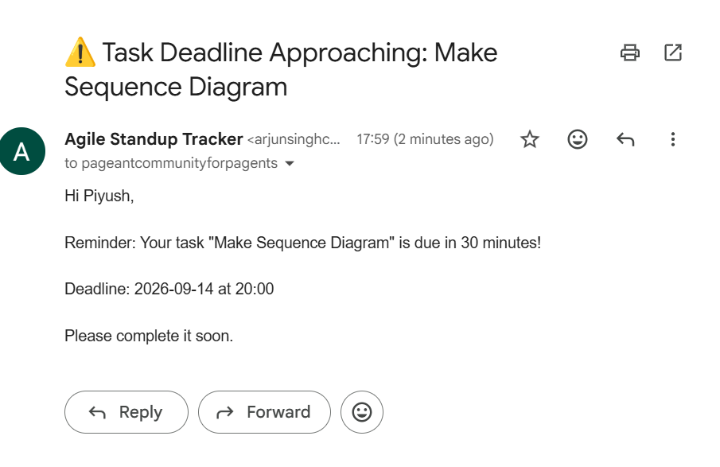
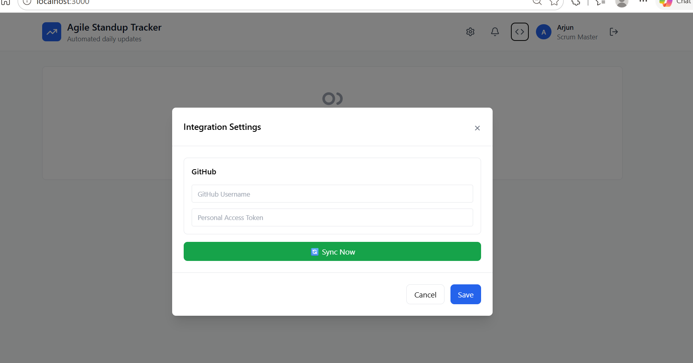

# 📈 Agile Standup Tracker

**Automated daily standups, task assignment, and email notifications — all in one lightweight dashboard.**

Agile Standup Tracker helps Scrum Masters assign tasks to their team, track daily standup updates (yesterday / today / blockers), and automatically notify team members by email when tasks are assigned or deadlines are approaching. It also supports syncing activity from GitHub.

---

## ✨ Features

- 🧑‍💼 **Simple onboarding** — set up your first user (Scrum Master or Team Member) in seconds, no complex signup flow.
- 👥 **User management** — add or remove team members and assign roles (Scrum Master / Team Member) from a clean settings panel.
- 📋 **Daily standup board** — every team member tracks:
  - What I did yesterday
  - What I will do today
  - Blockers & issues
- ✅ **Task assignment** — Scrum Masters assign tasks with a description, deadline date, and deadline time directly to a team member.
- 📊 **Team overview dashboard** — see team members, completed tasks, in-progress tasks, and active blockers at a glance.
- 📧 **Automated email notifications** (via Nodemailer):
  - Instant "New Task Assigned" email the moment a task is created.
  - Automatic reminder email **30 minutes before the deadline**.
- 🔔 **In-app notification center** — view sent and scheduled emails without leaving the dashboard.
- 🔗 **GitHub integration** — connect a GitHub username + Personal Access Token and sync repository activity into the tracker.
- 🔐 **Role-based views** — Scrum Masters see the team overview and task assignment tools; Employees see their personal standup board.

---

## 📸 Screenshots

### Onboarding
Set up your first Scrum Master account to get started.



### User Management
Add or remove team members and assign roles.



### Team Overview (Scrum Master view)
Track team members, completed tasks, in-progress tasks, and blockers.



### Assign a Task
Create and assign tasks with a deadline — email notifications are sent automatically.





### Employee Standup View
Team members see their assigned tasks and log daily standup updates.



### Email Notifications
In-app tracking of sent and scheduled emails.



**Actual emails received:**

| New Task Assigned | Deadline Reminder |
|---|---|
|  |  |

### GitHub Integration
Connect your GitHub account to sync activity into the tracker.



---

## 🛠️ Tech Stack

**Backend**
- Node.js + Express
- Axios
- CORS, body-parser, dotenv
- Nodemailer (email notifications)
- node-cron (scheduled reminder emails)

**Frontend**
- React (component-based dashboard UI)

---

## 🚀 Getting Started

### Prerequisites
- Node.js (v18+ recommended)
- npm

### 1. Clone the repository
```bash
git clone https://github.com/ArjunChauhan-BA/agile-standup-tracker.git
cd agile-standup-tracker
```

### 2. Install dependencies

**Backend**
```bash
cd backend
npm install
```

**Frontend**
```bash
cd ../frontend
npm install
```

### 3. Configure environment variables

Create a `.env` file inside `backend/` with your email and GitHub credentials:

```env
PORT=5000

# Email (Nodemailer) config
EMAIL_HOST=smtp.gmail.com
EMAIL_PORT=587
EMAIL_USER=your-email@gmail.com
EMAIL_PASS=your-app-password

# GitHub integration
GITHUB_USERNAME=your-github-username
GITHUB_TOKEN=your-personal-access-token
```

> ⚠️ In development, email sending can run in a mock/log mode. Connect a real SMTP provider (e.g. Gmail with an App Password) to send live emails in production.

### 4. Run the app

**Backend**
```bash
cd backend
node server.js
```

**Frontend**
```bash
cd frontend
npm start
```

The app will be available at **http://localhost:3000**, with the API running on the port set in `.env` (default `5000`).

---

## 👤 Roles

| Role | Access |
|---|---|
| **Scrum Master** | Manage users, view team overview, assign tasks, sync GitHub, view all notifications |
| **Team Member / Employee** | View and update personal daily standup, see assigned tasks and deadlines |

---

## 📬 Email Notification Flow

1. A Scrum Master assigns a task with a deadline.
2. An **assignment email** is sent immediately to the assigned team member.
3. A **reminder email** is automatically scheduled and sent **30 minutes before the deadline** via `node-cron`.
4. All sent/scheduled emails are visible in the in-app **Email Notifications** panel.

---

## 📄 License
© 2026 Arjun Chauhan. All rights reserved.

This project and its source code are proprietary. No part of this repository may be copied, modified, distributed, or used without explicit written permission from the author.
